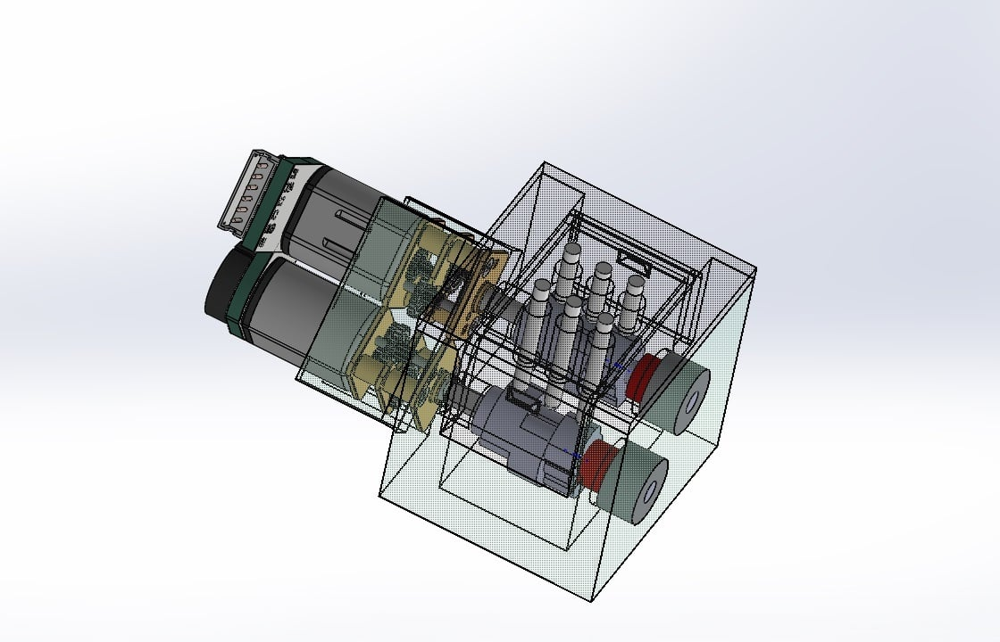
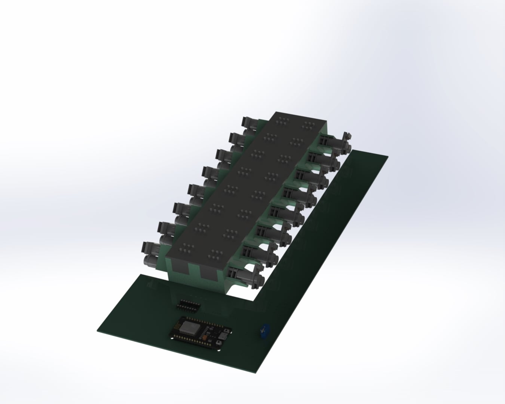

# Refreshable Braille Display: Team Dot Vision

## Problem Statement

About only 1% of published books are designed for visually impaired people. And, within those specific books, only a few percent is in Braille. This fact was a light bulb moment for us to design a refreshable braille display to accomodate literary activities for visually impaired.

## Our idea

We thought of making a full-size braille display of multiple rows along with navigation features like Next and Previous buttons. Due to time constraint in the hackathon, we proceeded with implementing a single braille cell.

Fig. Braille Cell

Fig. Braille Board

## References
### Project Files

[Google Drive Link](https://drive.google.com/drive/u/0/folders/1ojhiNgwglBnV9IFRLw-7x4dL1nsZ8iGQ)

### Demo Video

[Video](https://drive.google.com/file/d/1T6u3sfXOxb4T7LDcAPX14L5-VPvLE1rO/view?usp=drive_link)
